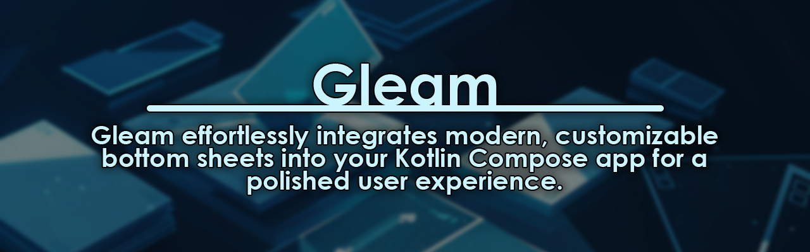

## Why Gleam?

Tired of the same old, generic bottom sheets that stifle your innovative Compose app? Enter Gleam,
**the modern and customizable bottom sheet library** designed to empower your creativity and elevate
your user experience.

#### [Jump to Download](#download)

Here's why Gleam should be your go-to choice:

**🎨 Modern & Customizable:**

* Design stunning bottom sheets that seamlessly match your app's aesthetic with Gleam's wide range
  of customization options. Say goodbye to generic, cookie-cutter designs!
* Shape, color, elevation, animations, and more are all easily configurable to create a unique and
  immersive user experience.

**🚀 Effortless Integration:**

* Integrate Gleam into your Compose codebase in a snap. No complex setups or boilerplate code. Just
  focus on building amazing features!
* Gleam plays nicely with other Compose components and tools, making it the perfect addition to your
  existing workflow.

**📊 Powerful & Flexible:**

* Handle long lists of actions, detailed information with icons, or confirmations confidently with
  Gleam's ability to adapt to various content types.
* Whether you need a simple confirmation dialog or a complex configuration sheet, Gleam has you
  covered.

**🤹‍♂️ Easy Interaction:**

* Enable user interaction with intuitive gestures and actions for a more engaging and delightful
  experience.
* Make your bottom sheets interactive and responsive, adding a dynamic touch to your app.

**✨ Polished & Refined:**

* Ensure a smooth and seamless user experience with Gleam's polished animations and intuitive
  interactions.
* Gleam takes care of the details so you can focus on delivering top-notch value to your users.

**Description:**

Gleam brings beautiful, interactive bottom sheets to your Kotlin Compose app. Design with ease,
seamlessly integrate, and elevate your user experience.

## Download

[](https://central.sonatype.com/search?q=g%3A%22dev.teogor.gleam%22+a%3A%22gleam%22&smo=true)

### Gradle

Add the dependency below into your **module**'s `build.gradle` file:

=== "Kotlin"

    ```kotlin
    dependencies {
      implementation("dev.teogor.gleam:gleam:1.0.0-alpha01")
    }
    ```

=== "Groovy"

    ```groovy
    dependencies {
      implementation "dev.teogor.gleam:gleam:1.0.0-alpha01"
    }
    ```

## Documentation

For comprehensive details about Gleam, please refer to the
complete [documentation available here](https://source.teogor.dev/gleam).

## Implementation

### Implementing Gleam

This section provides a step-by-step guide to using `Gleam` in your Compose app:

**1. Create a State Variable:**

```kotlin
var showGleam by remember { mutableStateOf(false) }
```

This state variable controls the visibility of the Gleam bottom sheet. Initially, it's set
to `false`, keeping the sheet hidden.

**2. Render the Button:**

```kotlin
Button(
  modifier = Modifier.fillMaxWidth(), // Fill the available width
  onClick = { showGleam = true },
) {
  Text(text = "Show Gleam")
}
```

This creates a button with the text "Show Gleam". When clicked, it sets `showGleam` to `true`,
triggering the bottom sheet to appear. You can customize the button's appearance and position as
needed.

**3. Conditionally Render Gleam:**

```kotlin
if (showGleam) {
  Gleam(
    onDismissRequest = { showGleam = false }, // Hide sheet on dismissal
    windowInsets = WindowInsets.none, // Remove default insets
    properties = GleamDefaults.properties(
      // Customize appearance
      animateCorners = true,
      animateHorizontalEdge = true,
      maxHorizontalEdge = 14.dp,
    ),
  ) {
    // Your bottom sheet content goes here
    Text(text = "This is the Gleam content!")
    Button(
      onClick = { // Add an action button
        showGleam = false // Hide sheet on action
        // Perform other actions here
      },
    ) {
      Text(text = "Perform Action")
    }
  }
}
```

This part is crucial:

- The `if` block ensures the Gleam sheet only renders when `showGleam` is `true`.
- The `Gleam` composable configures the sheet's behavior and appearance:
  - `onDismissRequest`: Hides the sheet when the user swipes down or taps outside.
  - `windowInsets`: Adjusts padding based on system elements.
  - `properties`: Defines customization options like animation and corner radius.
- The content inside the `{}` block defines what appears inside the sheet. For this example, a text
  message and an action button are included.

View implementation in [demo](app/src/main/kotlin/dev/teogor/gleam/demo/MainActivity.kt)

### Implementing Gleam with Scaffolding (GleamScaffold)

This section provides a step-by-step guide to using `GleamScaffold` in your Compose app:

**1. Create State Variable:**

```kotlin
var showGleam by remember { mutableStateOf(false) }
```

This state variable controls the visibility of the Gleam bottom sheet. Initially, it's set
to `false`, keeping the sheet hidden.

**2. Implement GleamScaffold:**

```kotlin
GleamScaffold(
  isVisible = showGleam,
  gleamContent = {
    // Your Gleam sheet content here
    Column(modifier = Modifier.padding(16.dp)) {
      Text("This is the Gleam content!")
      Button(
        onClick = { showGleam = false },
        modifier = Modifier.align(Alignment.CenterHorizontally)
      ) {
        Text("Close")
      }
    }
  },
) {
  // Your main app content (repeated for clarity)
  Text("This is the main app content")
  Button(
    onClick = { showGleam = true },
    modifier = Modifier.fillMaxWidth()
  ) {
    Text("Show Gleam")
  }
}
```

Wrap your main app content with `GleamScaffold`

**Key Points:**

- `GleamScaffold` simplifies sheet creation and management.
- Consistent structure reduces boilerplate code.
- Customizable appearance enhances app design.

By following these steps and adapting them to your specific needs, you can effectively
use `GleamScaffold` to create engaging and well-designed bottom sheets in your Compose apps.

### Implementing Gleam with Navigation

> [!NOTE]
> Ensure you have added the `dev.teogor.gleam:gleam-navigation` dependency

This guide will walk you through integrating GleamScaffold with navigation using
the `GleamScaffold` composable:

**1. Initialize GleamNavigator:**

Use `rememberGleamNavigator` to create a navigation manager and associate it with the current
composition:

```kotlin
val navigator = rememberGleamNavigator()
```

**2. Connect GleamNavigator to NavController (Required):**

If you use a separate compose navigation controller (`NavController`), link it to
the `GleamNavigator`:

```kotlin
val navController = rememberNavController()
navigator.provideNavController(navController)
```

**3. Use GleamScaffold:**

Wrap your app's content with `GleamScaffold`, providing the `navigator` and configuring other
desired options:

```kotlin
GleamScaffold(
  navigator = navigator, // Connect the initialized navigator
  modifier = Modifier.fillMaxSize(), // Optional modifiers
  shape = sheetShape, // Customize sheet shape (optional)
  containerColor = sheetBackgroundColor, // Set sheet background color (optional)
  windowInsets = WindowInsets.navigationBars, // Optional insets adjustment
  properties = GleamDefaults.properties(
    // Customize sheet behavior (optional)
    animateCorners = true,
    animateHorizontalEdge = true,
    maxHorizontalEdge = 14.dp,
  ),
  content = content, // Your main app content goes here
)
```

## Components

This section introduces the core building blocks of our UI library: `Gleam` and `GleamScaffold`.
They offer powerful and flexible ways to display content, interact with users, and enhance your
app's user experience.

### Gleam

**Purpose:**

- Represents the actual bottom sheet content that slides up from the screen.
- Offers an alternative to inline menus or simple dialogs for mobile apps.

**Parameters:**

- `onDismissRequest`: Called when the user dismisses the `Gleam` by clicking outside.
- `modifier`: Optional modifiers for the `Gleam`.
- `gleamState`: The state object managing the `Gleam`'s visibility and animation (
  usually `rememberGleamState()`).
- `gleamMaxWidth`: Maximum width of the `Gleam` in `Dp` (use `Dp.Unspecified` for full width).
- `shape`: Defines the shape of the `Gleam`'s container (e.g., rounded corners).
- `containerColor`: The background color of the `Gleam` container.
- `contentColor`: Preferred color for content inside the `Gleam` (defaults based
  on `containerColor`).
- `tonalElevation`: The shadow level of the `Gleam` (in `Dp`).
- `scrimColor`: The color of the overlay behind the `Gleam` when open.
- `dragHandle`: Optional composable for a visual swipe handle.
- `windowInsets`: Insets for proper layout and positioning.
- `properties`: Additional customization options through `GleamProperties`.
- `content`: The content displayed inside the `Gleam`, defined as a composable function.

### GleamScaffold

**Purpose:**

- Displays a `Gleam` modal window that slides up from the bottom of the screen.
- Suitable for presenting long action lists, detailed information with icons, or confirmations.
- Temporarily disables other app content and remains visible until dismissed or an action is taken.

**Parameters:**

- `gleamContent`: The content displayed inside the `Gleam`, defined as a composable function.
- `isVisible`: Boolean, determines if the `Gleam` is visible (`true`) or hidden (`false`).
- `modifier`: Optional modifiers to apply to the `Gleam`.
- `gleamState`: The state object managing the `Gleam`'s visibility and animation (
  usually `rememberGleamState()`).
- `gleamMaxWidth`: Maximum width of the `Gleam` in `Dp` (use `Dp.Unspecified` for full width).
- `shape`: Defines the shape of the `Gleam`'s container (e.g., rounded corners).
- `containerColor`: The background color of the `Gleam` container.
- `contentColor`: Preferred color for content inside the `Gleam` (defaults based
  on `containerColor`).
- `tonalElevation`: The shadow level of the `Gleam` (in `Dp`).
- `scrimColor`: The color of the overlay behind the `Gleam` when open.
- `dragHandle`: Optional composable for a visual swipe handle.
- `windowInsets`: Insets for proper layout and positioning.
- `properties`: Additional customization options through `GleamProperties`.
- `content`: The content displayed beneath the `Gleam`.

## Find this repository useful? 🩷

* Support it by joining __[stargazers](https://github.com/teogor/gleam/stargazers)__ for this
  repository. 📁
* Get notified about my new projects by __[following me](https://github.com/teogor)__ on GitHub. 💻
* Interested in sponsoring me? [Support me](sponsor.md) on GitHub! 🤝

### License

```xml
  Designed and developed by 2024 teogor (Teodor Grigor)

  Licensed under the Apache License, Version 2.0 (the "License");you may not use this file except in compliance with the License.You may obtain a copy of the License at

  http://www.apache.org/licenses/LICENSE-2.0

  Unless required by applicable law or agreed to in writing, softwaredistributed under the License is distributed on an "AS IS" BASIS,WITHOUT WARRANTIES OR CONDITIONS OF ANY KIND, either express or implied.See the License for the specific language governing permissions andlimitations under the License.
```
